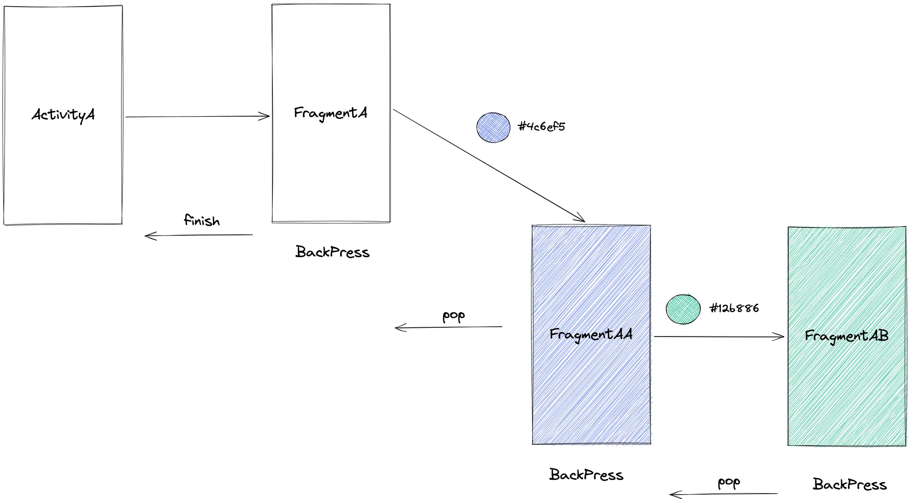
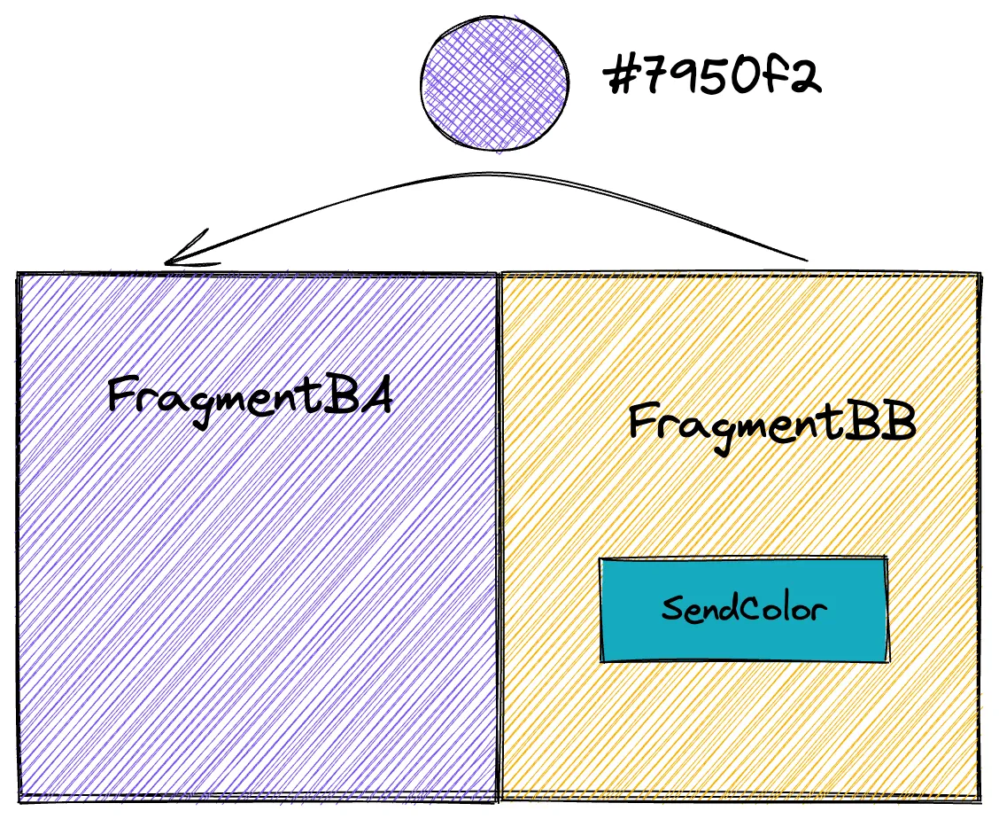
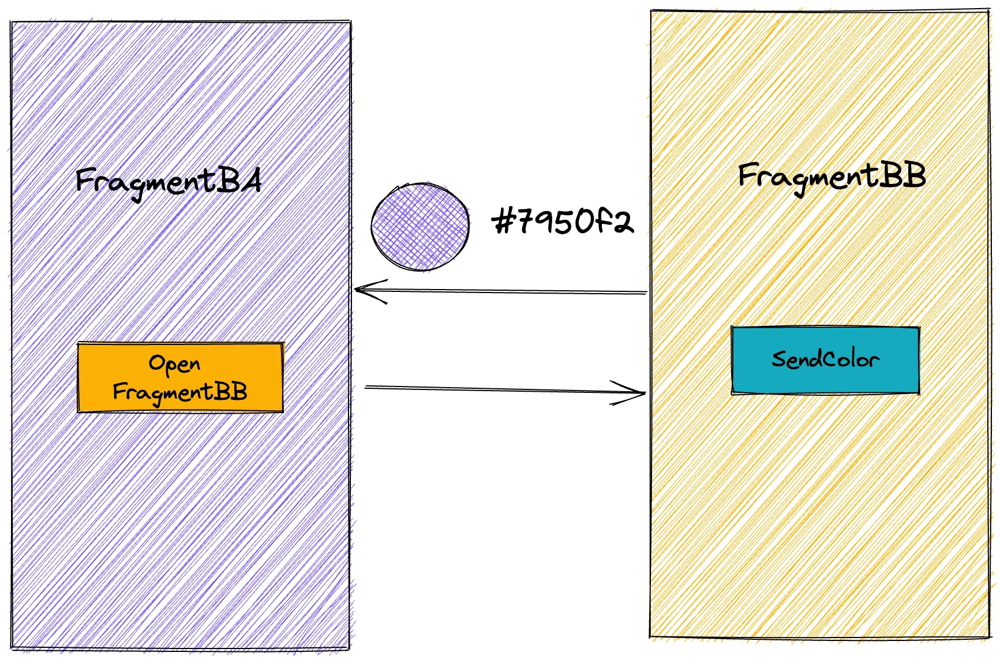

# Fragments

**Цель работы**: научиться работать с Fragment API, научиться реализовывать обмен данными между фрагментами на разных уровнях вложенности.

## Задание #0

В этом домашнем задании вам необходимо решить две задачи с корневыми фрагментами **FragmentA** и **FragmentB**.

1. Реализуйте две активити, в каждой из которых будет по одному фрагменту **FragmentA** и **FragmentB**.
2. Реализуйте кнопки перехода в активити с фрагментами в **MainActivity**.

## Задание #1

1. По клику на кнопку запустите фрагмент транзакцию которая открывает **FragmentA**.
2. В **FragmentA** добавьте кнопку, которая открывает фрагмент **FragmentAA**, при этом он должен быть child фрагментом для **FragmentA**. 
   При открытии **FragmentAA**, передайте в него цвет, полученный из рандомайзера **ColorGenerator** и покрасьте **FragmentAA** в этот цвет.
3. В **FragmentAA** также добавьте кнопку которая открывает **FragmentAB**, который также является чайлдом **FragmentA**. 
   Также передайте в аргументы цвет полученный из **ColorGenerator** и подкрасьте **FragmentAB** в этот цвет.
4. Реализуйте обработку нажатия на кнопку “Назад”, используя **OnBackPressedDispatcher**, таким образом, что по нажатию из стека фрагментов удаляется один 
   фрагмент. После того как размер стека = 1, закрывайте активити.

## Задание #2

Реализуйте два фрагмента **FragmentBA** и **FragmentBB** и организуйте обмен данными от фрагмента **FragmentBB** к фрагменту **FragmentBA**:

1. Если девайс находится в landscape ориентации, то расположите фрагменты на одном уровне иерархии. В фрагмент **FragmentBB** добавьте кнопку, 
   по нажатию на которую программа получит цвет из рандомайзера **ColorGenerator** и передаст его в **FragmentBA**, используя **FragmentResultListener**.
   Покрасте фон **FragmentBA** в полученный цвет.
   
2. Если девайс находится в portrait ориентации, добавьте в **FragmentBA** кнопку, по нажатию на которой будет открываться **FragmentBB**, на том же уровне 
   иерархии, что и **FragmentBA**. В **FragmentBB** добавьте кнопку, которая получит цвет из рандомайзера **ColorGenerator** и вернет результат в **FragmentBA**.
   Как и в пункте 1, покрасте фон **FragmentBA** в полученный цвет.
   
